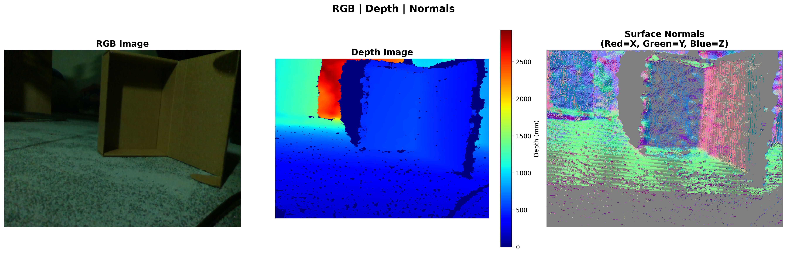

# High‑Performance Depth Processing for Intel RealSense

Final project for the “High‑Performance Python” course.

  

## Project overview

This project demonstrates how to optimize depth processing from an Intel RealSense camera for robotics‑style workloads. Core tasks:
- Surface normal estimation from depth images
- Depth denoising and basic statistics
- Conversion to 3D point clouds

There are three equivalent implementations of the same pipeline:
1. **Baseline** (NumPy) — readable Python/NumPy reference
2. **Numba** — CPU JIT compilation with parallelization
3. **GPU** (CuPy) — acceleration on NVIDIA GPU (CUDA)

## Repository structure

```
.
├── process_depth_basic.py    # Baseline (NumPy)
├── process_depth_numba.py    # Optimized (Numba JIT)
├── process_depth_gpu.py      # GPU-accelerated (CuPy)
├── benchmark.py              # Benchmark and comparison
├── visualize_results.py      # Visualizations
├── live_preview.py           # Real-time preview (depth + normals)
├── requirements.txt          # Dependencies
└── README.md                 # This file
```

## Installation

1. Install dependencies:
```bash
pip install -r requirements.txt
```

2. For GPU support make sure CUDA and a matching CuPy wheel are installed:
```bash
# For CUDA 11.x
pip install cupy-cuda11x

# For CUDA 12.x
pip install cupy-cuda12x
```

3. Plug in the Intel RealSense camera.

## Usage

### Quick start

Run the end‑to‑end project helper:

```bash
python run_all.py
```

### Benchmark

Main script to compare all versions and generate plots:

```bash
python benchmark.py --num-frames 100 --warmup 1
```

This produces:
- Performance plots under `plots/with_warmup/` and `plots/steady_state/`
- A combined JSON file `benchmark_results.json`

### Visualizations

Create visualizations for depth and normals:

```bash
python visualize_results.py
```

### Profiling

Profile the pipeline to find hotspots:

```bash
python profile_code.py
```

### Testing without a camera

If a RealSense camera is not available, run on synthetic depth:

```bash
python test_without_camera.py
```

### Running individual variants

```bash
# Baseline
python process_depth_basic.py

# Numba version
python process_depth_numba.py

# GPU version (if available)
python process_depth_gpu.py
```

## Results

The project demonstrates:
- **Profiling** Python code to identify bottlenecks
- **CPU JIT optimization** with Numba
- **GPU acceleration** with CuPy
- **Apples‑to‑apples comparison** of approaches

Typical speedups:
- Numba: 5–15× vs. baseline
- GPU (CuPy): 10–30× vs. baseline (hardware‑dependent)

## Techniques from the course

- ✅ Profiling Python programs (cProfile, line_profiler)
- ✅ NumPy optimization and vectorization
- ✅ Numba JIT compilation
- ✅ CuPy GPU acceleration
- ✅ Parallelization

## Robotics use cases

Processed data can be used for:
- Navigation and SLAM
- Obstacle detection
- Path planning
- Manipulation
- 3D scene reconstruction

## Author
Sergey Gumirov, Artem Erkhov, Danil Belov

## License

MIT

